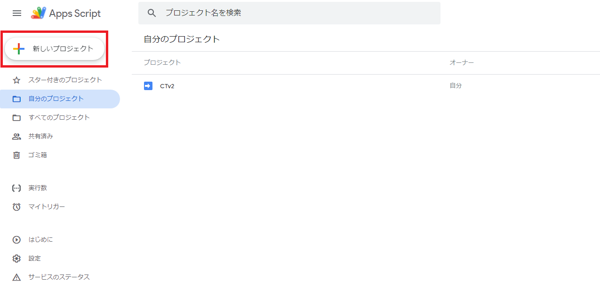
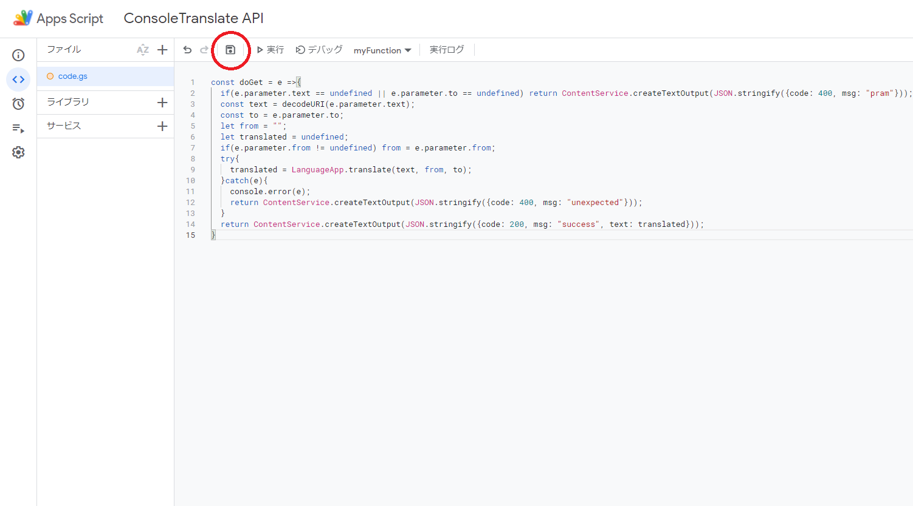
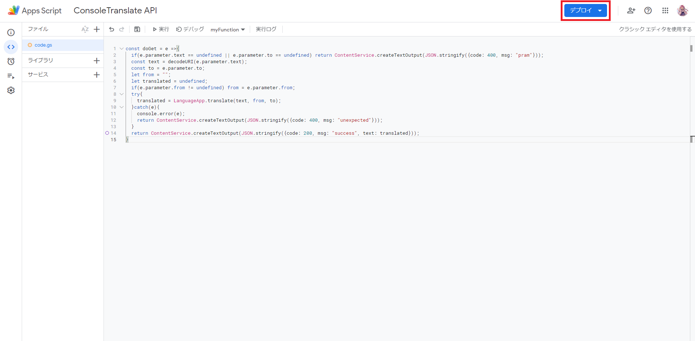
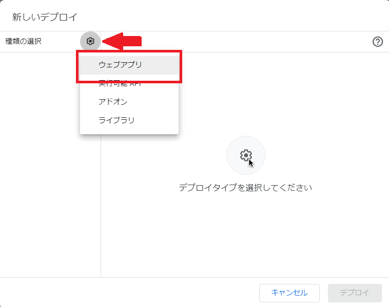
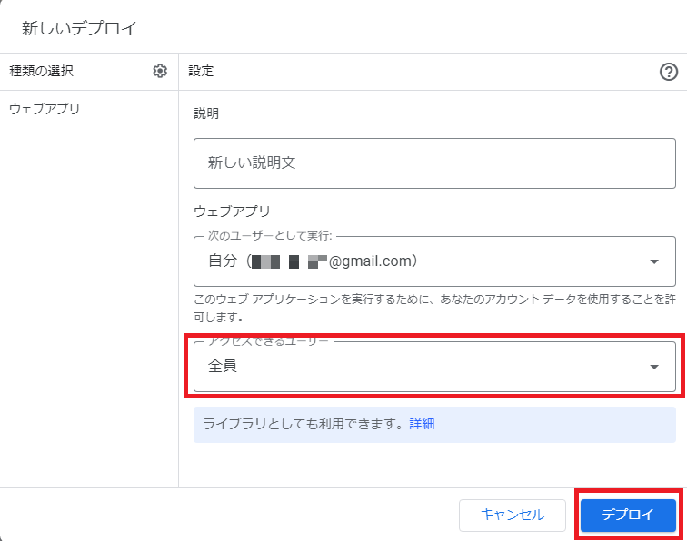
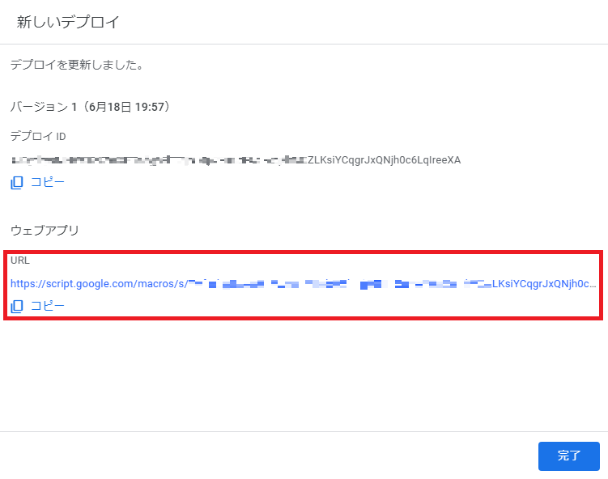

# APIキー発行

ConsoleTranslateで使用するAPIのAPIキーを発行します

# 手順

DeepL翻訳とGoogle翻訳のどちらを使用するか選ぶことができます。どちらも無料です(DeepLには有料プランあり)

- Google翻訳(GAS)の場合はGoogleアカウント1つでセットアップでき、手軽に利用することができます。

- DeepLの場合は少し登録は大変ですが、DeepLの高精度翻訳を利用できます

[GoogleTranslate(GAS)で発行](#googletranslategasで発行)

[DeepLで発行](#deeplで発行)

## DeepLで発行

1. [DeepL APIに登録](https://www.deepl.com/pro-api?cta=header-pro-api) にて登録してください。

2. [DeepLのアカウント](https://www.deepl.com/ja/account/summary/) の1番下にある`DeepL APIで使用する認証キー`をコピーしてください

3. [⚡ インストール](./README.md#-インストール)の`5.`へ戻り設定を続けてください

## GoogleTranslate(GAS)で発行

1. Googleアカウントにログインした状態で https://script.google.com/ にアクセスしします

2. 「新しいプロジェクト」からプロジェクトを作成します



3. 下記のコードを貼り付け、保存します

```
const doGet = e =>{
  if(e.parameter.text == undefined || e.parameter.to == undefined) return ContentService.createTextOutput(JSON.stringify({code: 400, msg: "pram"}));
  const text = decodeURI(e.parameter.text);
  const to = e.parameter.to;
  let from = "";
  let translated = undefined;
  if(e.parameter.from != undefined) from = e.parameter.from;
  try{
    translated = LanguageApp.translate(text, from, to);
  }catch(e){
    console.error(e);
    return ContentService.createTextOutput(JSON.stringify({code: 400, msg: "unexpected"}));
  }
  return ContentService.createTextOutput(JSON.stringify({code: 200, msg: "success", text: translated}));
}
```



4. 右上にある「デプロイ」を押し「新しいデプロイ」を選択



5. 左上の歯車⚙から「ウェブアプリ」を選択



6. 下記画像の様に設定し、「デプロイ」を押す



7. 表示されている「URL」をコピー



### これでAPIキーの作成ができました。`7` でコピーしたものをメモして [⚡ インストール](./README.md#-インストール)　へ戻ってください
